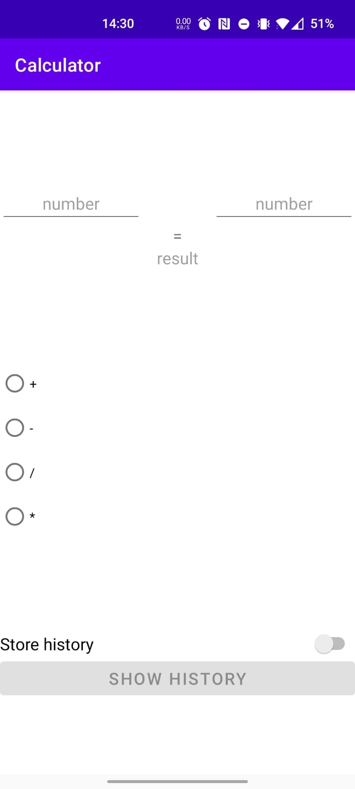
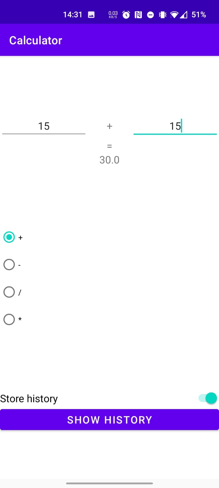
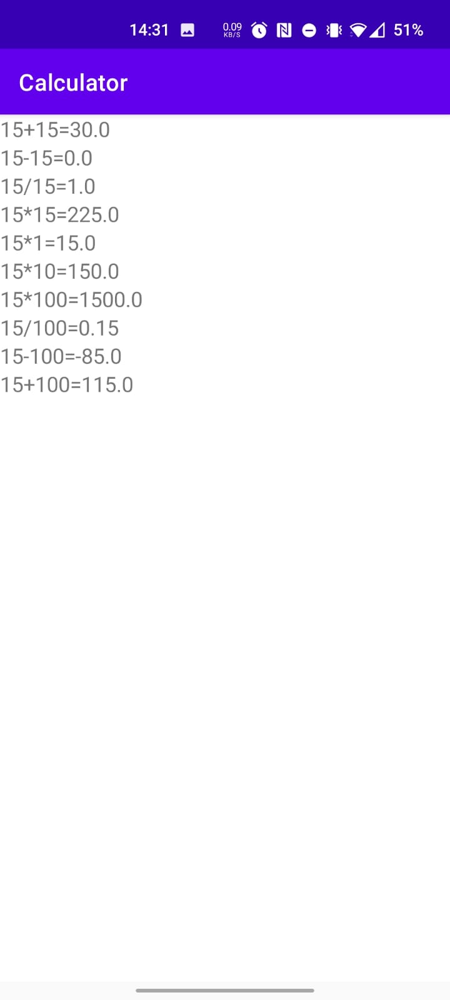

1. [Introduction](#introduction)
2. [Features](#features)
    * [Current features](#current-features)
    * [UI](#ui)
        * [General overview of main UI](#general-overview-of-main-ui)
        * [Execute a calculation](#execute-a-calculation)
        * [View history](#view-history)

# Introduction

This app is a simple calculator for Android written in Kotlin. It supports the functionality to store calculation history. The calculator supports all four basic arithmetic operations.

# Features

## Current features
- Calculate solutions with 4 basic arithmetic operators (+, -, /, *)
- Store history and view it  
- Clear history

## UI

### General overview of main UI

### Execute a calculation

### View history
